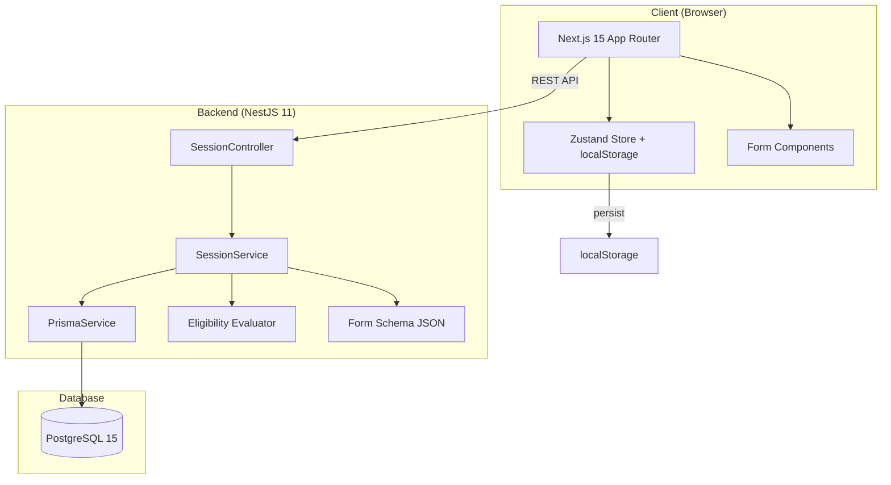
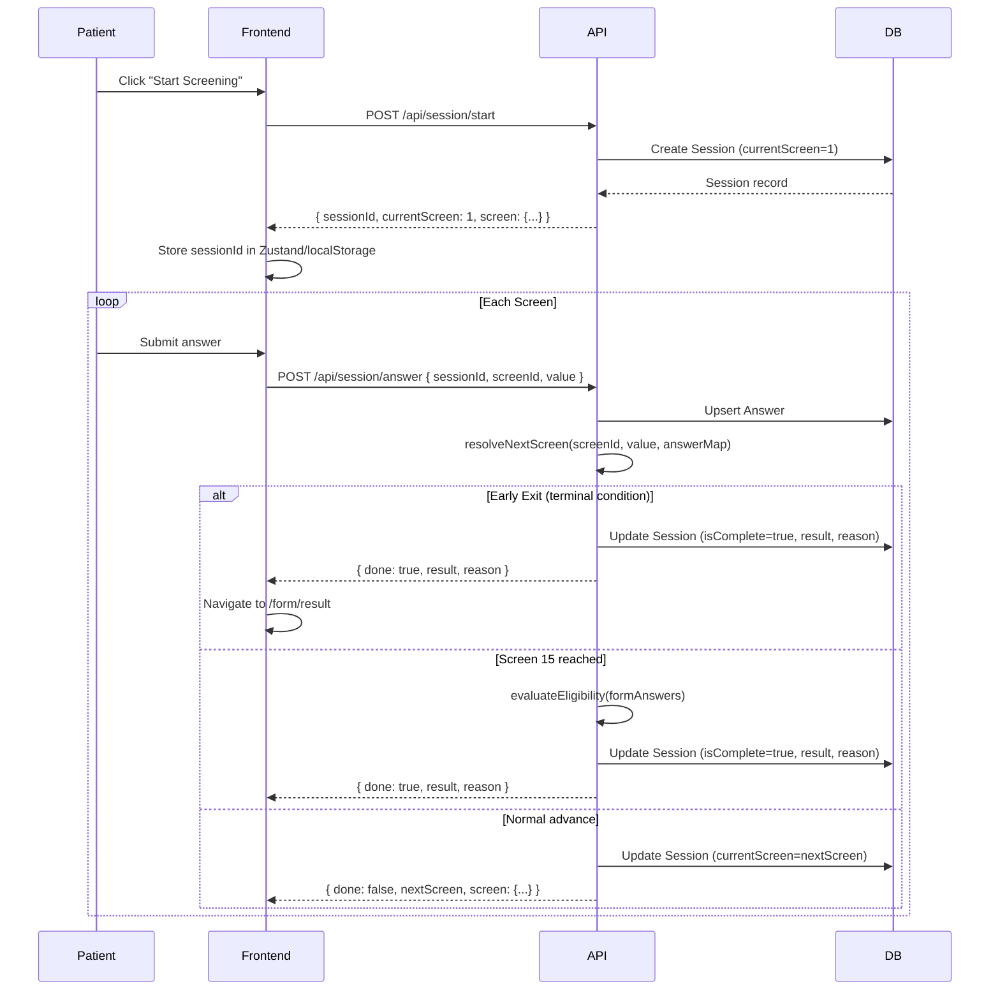
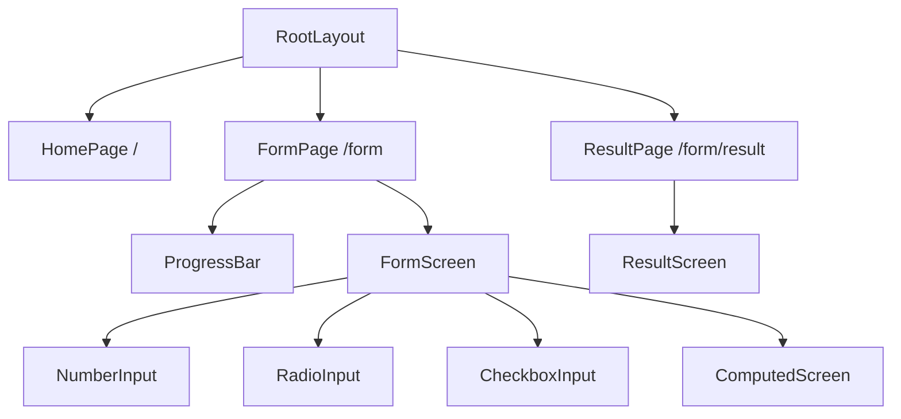
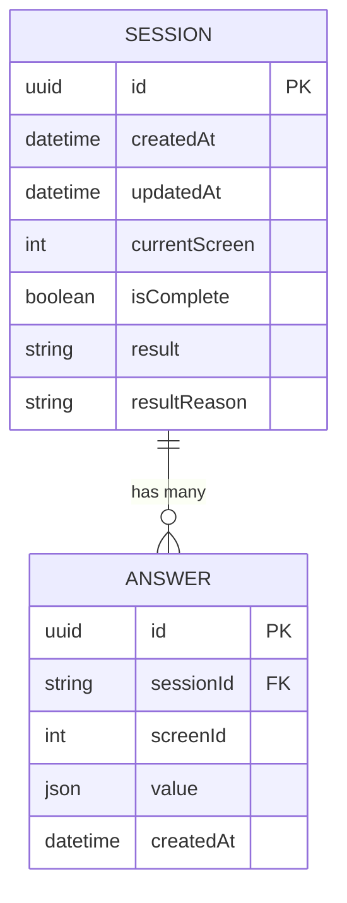
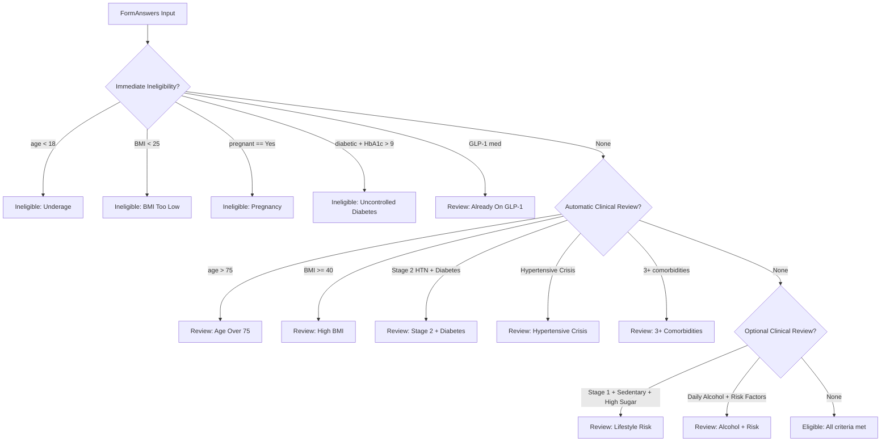

# Design Document: GLP-1 Eligibility Screening Form

## Overview

This design describes a full-stack GLP-1 medication eligibility screening application built as an npm workspaces monorepo. The system guides patients through a 15-screen medical questionnaire, computes BMI, evaluates eligibility using a pure function with priority-ordered checks, and returns one of three outcomes: "Eligible", "Ineligible", or "Requires Clinical Review".

The architecture separates concerns into:
- **Backend API** (NestJS 11): Session management, answer persistence, server-side branching resolution, and eligibility evaluation
- **Frontend UI** (Next.js 15): Dynamic form rendering, state management with session resume, and accessible result display
- **Database** (PostgreSQL 15): Persistent storage for sessions and answers
- **Eligibility Evaluator**: A pure function with zero framework dependencies for portable, testable eligibility logic

### Key Design Decisions

| Decision | Rationale |
|----------|-----------|
| Server-side branching | Prevents clients from bypassing eligibility logic; single source of truth |
| Pure function evaluator | Independently testable, no framework coupling, portable |
| Zustand with persist middleware | Handles localStorage serialization automatically for session resume |
| Single JSON form schema | Shared between frontend and backend; one source of truth for screen definitions |
| Switch/case branching in SessionService | Explicit, readable, and easy to test per-screen logic |

---

## Architecture

### System Architecture Diagram



### Request Flow



---

## Components and Interfaces

### Backend Components

#### SessionController (`/api/session`)

| Endpoint | Method | Description |
|----------|--------|-------------|
| `/api/session/start` | POST | Creates a new session, returns sessionId and first screen |
| `/api/session/:id` | GET | Returns full session state for resume |
| `/api/session/answer` | POST | Persists answer, resolves branching, returns next screen or result |

#### SessionService

Responsible for:
- Creating sessions
- Persisting answers (upsert on sessionId + screenId)
- Resolving branching logic via `resolveNextScreen()` switch/case
- Building `FormAnswers` from answer map and invoking the evaluator at screen 15
- Updating session state (currentScreen, isComplete, result)

#### Eligibility Evaluator (Pure Function)

```typescript
// Input
interface FormAnswers {
  age: number;
  weight: number;
  height: number;
  bmi: number;
  pregnant: "Yes" | "No";
  comorbidConditions: string[];
  hasDiabetes: "Yes" | "No";
  hba1c?: number;
  bloodPressure: string[];
  medications: string[];
  smokingStatus: "Yes" | "No";
  alcoholFrequency: "Never" | "Monthly" | "Weekly" | "Daily";
  activityLevel: "Sedentary" | "Light (1–2x/week)" | "Moderate (3–4x/week)" | "Vigorous (5+x/week)";
  dietaryHabits: string[];
}

// Output
interface EligibilityReason {
  result: "Eligible" | "Ineligible" | "Requires Clinical Review";
  reason: string;
}

// Entry point
function evaluateEligibility(answers: FormAnswers): EligibilityReason;
function computeBMI(weightKg: number, heightCm: number): number;
```

#### PrismaService

Extends `PrismaClient`, implements `OnModuleInit` and `OnModuleDestroy` for connection lifecycle management.

### Frontend Components



#### Component Hierarchy

| Component | Path | Responsibility |
|-----------|------|----------------|
| `RootLayout` | `app/layout.tsx` | HTML shell, metadata, global styles |
| `HomePage` | `app/page.tsx` | Landing page with "Start Screening" CTA |
| `FormPage` | `app/form/page.tsx` | Orchestrates session lifecycle, renders current screen |
| `ResultPage` | `app/form/result/page.tsx` | Displays eligibility result with appropriate styling |
| `ProgressBar` | `components/ProgressBar.tsx` | Accessible progress indicator (role="progressbar") |
| `FormScreen` | `components/FormScreen.tsx` | Dispatches to correct input component based on inputType |
| `NumberInput` | `components/inputs/NumberInput.tsx` | Numeric input with min/max validation |
| `RadioInput` | `components/inputs/RadioInput.tsx` | Radio group within fieldset/legend |
| `CheckboxInput` | `components/inputs/CheckboxInput.tsx` | Checkbox group within fieldset/legend |
| `ComputedScreen` | `components/inputs/ComputedScreen.tsx` | Displays BMI, auto-advances after 2s |
| `ResultScreen` | `components/result/ResultScreen.tsx` | Color-coded result display |

#### State Management (Zustand Store)

```typescript
interface SessionState {
  sessionId: string | null;
  currentScreen: number;
  answers: ScreenAnswer[];
  isComplete: boolean;
  result: string | null;
  resultReason: string | null;

  // Actions
  setSessionId: (id: string) => void;
  setCurrentScreen: (screen: number) => void;
  saveLocalAnswer: (screenId: number, value: unknown) => void;
  setComplete: (result: string, reason: string) => void;
  reset: () => void;
}
```

Persistence config:
- localStorage key: `"glp1-session"`
- `partialize`: persists only data fields (not action functions)
- On `/form` load: if `sessionId` exists, fetch session from API and resume

#### API Client (`lib/api.ts`)

```typescript
const API_BASE = process.env.NEXT_PUBLIC_API_URL ?? "http://localhost:4000/api";

startSession(): Promise<{ sessionId, currentScreen, screen }>
getSession(sessionId: string): Promise<SessionResponse>
saveAnswer(sessionId: string, screenId: number, value: unknown): Promise<AnswerResponse>
```

---

## Data Models

### Prisma Schema

```prisma
generator client {
  provider = "prisma-client-js"
}

datasource db {
  provider = "postgresql"
  url      = env("DATABASE_URL")
}

model Session {
  id            String    @id @default(uuid())
  createdAt     DateTime  @default(now())
  updatedAt     DateTime  @updatedAt
  currentScreen Int       @default(1)
  isComplete    Boolean   @default(false)
  result        String?   // "Eligible" | "Ineligible" | "Requires Clinical Review"
  resultReason  String?
  answers       Answer[]
}

model Answer {
  id        String   @id @default(uuid())
  sessionId String
  screenId  Int
  value     Json     // flexible: number | string | string[]
  createdAt DateTime @default(now())
  session   Session  @relation(fields: [sessionId], references: [id], onDelete: Cascade)

  @@unique([sessionId, screenId])
  @@index([sessionId])
}
```

### Entity Relationship



### API Response Shapes

**POST /api/session/start → 201**
```json
{
  "sessionId": "uuid",
  "currentScreen": 1,
  "screen": { "id": 1, "title": "Age", "prompt": "...", "inputType": "number", ... }
}
```

**GET /api/session/:id → 200**
```json
{
  "sessionId": "uuid",
  "currentScreen": 5,
  "isComplete": false,
  "result": null,
  "resultReason": null,
  "answers": [{ "screenId": 1, "value": 35 }, ...],
  "screen": { "id": 5, ... }
}
```

**POST /api/session/answer → 200 (advance)**
```json
{
  "done": false,
  "nextScreen": 6,
  "screen": { "id": 6, ... }
}
```

**POST /api/session/answer → 200 (terminal)**
```json
{
  "done": true,
  "result": "Ineligible",
  "reason": "Underage"
}
```

---

## Eligibility Evaluation Algorithm

The evaluator uses a priority-ordered cascade of checks. The first matching condition wins.



### Priority Order (strict)

1. **Immediate Ineligibility** — hard disqualifiers
2. **Automatic Clinical Review** — conditions requiring mandatory physician review
3. **Optional Clinical Review** — compound lifestyle risk factors
4. **Eligible** — default when no conditions trigger

### Branching Logic (Server-Side)

The `SessionService.resolveNextScreen()` method uses a switch/case on `screenId`:

| Screen | Condition | Action |
|--------|-----------|--------|
| 1 (Age) | age < 18 | End: Ineligible |
| 1 (Age) | age > 75 | End: Requires Clinical Review |
| 3 (Height) | computed BMI < 25 | End: Ineligible |
| 3 (Height) | computed BMI >= 40 | End: Requires Clinical Review |
| 5 (Pregnancy) | "Yes" | End: Ineligible |
| 7 (Diabetes) | "Yes" | Next: Screen 8 |
| 7 (Diabetes) | "No" | Next: Screen 9 (skip 8) |
| 8 (HbA1c) | value > 9.0 | End: Ineligible |
| 10 (Medications) | includes "GLP-1 receptor agonist" | End: Requires Clinical Review |
| 14 (Dietary) | default | Next: Screen 15 → run evaluator |

### BMI Computation

```
BMI = weight_kg / (height_cm / 100)²
```

Computed on Screen 3 submission using stored Screen 2 (weight) value. Screen 4 displays the result with a 2-second auto-advance timer.

---


## Correctness Properties

*A property is a characteristic or behavior that should hold true across all valid executions of a system — essentially, a formal statement about what the system should do. Properties serve as the bridge between human-readable specifications and machine-verifiable correctness guarantees.*

### Property 1: BMI computation is mathematically correct

*For any* valid weight in kilograms (20–300) and height in centimeters (100–250), `computeBMI(weight, height)` SHALL equal `weight / ((height / 100) ** 2)` within floating-point tolerance.

**Validates: Requirements 9.2, 7.3**

### Property 2: Immediate ineligibility conditions always produce "Ineligible"

*For any* `FormAnswers` where at least one immediate ineligibility condition holds (age < 18, BMI < 25, pregnant === "Yes", or diabetic with HbA1c > 9.0), `evaluateEligibility` SHALL return result "Ineligible" regardless of all other field values.

**Validates: Requirements 8.3, 7.1, 7.4, 7.6, 7.9**

### Property 3: Automatic clinical review conditions produce "Requires Clinical Review" when no ineligibility exists

*For any* `FormAnswers` that does NOT trigger any immediate ineligibility condition but DOES trigger at least one automatic clinical review condition (age > 75, BMI >= 40, Stage 2 Hypertension with Diabetes, Hypertensive Crisis, 3+ comorbid conditions, or already on GLP-1 therapy), `evaluateEligibility` SHALL return result "Requires Clinical Review".

**Validates: Requirements 8.4, 7.2, 7.5, 7.10**

### Property 4: Optional clinical review conditions produce "Requires Clinical Review" when no higher-priority conditions exist

*For any* `FormAnswers` that triggers neither immediate ineligibility nor automatic clinical review but DOES trigger an optional clinical review condition (Stage 1 Hypertension + Sedentary + High sugar intake, or Daily alcohol + risk factors), `evaluateEligibility` SHALL return result "Requires Clinical Review".

**Validates: Requirements 8.5**

### Property 5: Eligible is the default when no conditions trigger

*For any* `FormAnswers` that does NOT trigger any ineligibility condition, automatic clinical review condition, or optional clinical review condition, `evaluateEligibility` SHALL return result "Eligible" with reason "All criteria met".

**Validates: Requirements 8.6**

### Property 6: Priority order is strictly enforced

*For any* `FormAnswers` that triggers conditions at multiple priority levels simultaneously, `evaluateEligibility` SHALL return the result from the highest-priority level (Ineligible > Requires Clinical Review from auto > Requires Clinical Review from optional > Eligible).

**Validates: Requirements 8.7**

### Property 7: Answer persistence round-trip

*For any* valid session and valid answer (screenId within 1–15, value matching the screen's inputType constraints), submitting the answer via POST /api/session/answer and then retrieving the session via GET /api/session/:id SHALL include that answer with the original value preserved.

**Validates: Requirements 5.4**

### Property 8: Session state persistence round-trip (localStorage)

*For any* session state (sessionId, currentScreen, answers array), after the Zustand store is updated, reading from localStorage key "glp1-session" and parsing SHALL yield the same sessionId, currentScreen, and answers.

**Validates: Requirements 12.1**

### Property 9: Dynamic form rendering matches inputType

*For any* screen definition from the Form Schema with inputType in {"number", "radio", "checkbox"}, the rendered component SHALL contain the correct input element type (input[type=number] for number, input[type=radio] for radio, input[type=checkbox] for checkbox) within the appropriate container structure.

**Validates: Requirements 10.4, 11.1, 11.2, 11.3**

### Property 10: Validation errors set correct ARIA attributes

*For any* form input in an invalid state (value outside min/max for number, no selection when required for radio/checkbox), the input element SHALL have `aria-invalid="true"` and an associated error message element SHALL have `role="alert"`.

**Validates: Requirements 15.4, 15.5**

---

## Error Handling

### Backend Error Handling

| Scenario | HTTP Status | Response |
|----------|-------------|----------|
| Session not found | 404 | `{ statusCode: 404, message: "Session {id} not found" }` |
| Answer submitted to completed session | 400 | `{ statusCode: 400, message: "Session is already complete" }` |
| Invalid screenId | 400 | `{ statusCode: 400, message: "Unknown screen: {id}" }` |
| Validation failure (DTO) | 400 | `{ statusCode: 400, message: [...validation errors] }` |
| Database connection failure | 500 | `{ statusCode: 500, message: "Internal server error" }` |

### Frontend Error Handling

- **Network errors**: Display inline error message with retry option; do not lose form state
- **Session not found on resume**: Clear localStorage, redirect to home page to start fresh
- **Validation errors**: Display below the input with `role="alert"` and `aria-invalid="true"`
- **API timeout**: Show loading state with `aria-busy="true"`, retry after timeout

### Validation Strategy

- **Backend**: NestJS `ValidationPipe` with `class-validator` decorators on DTOs; whitelist strips unknown properties
- **Frontend**: Client-side validation before submission (min/max for numbers, required selection for radio/checkbox); server remains authoritative

---

## Testing Strategy

### Unit Testing (Vitest)

**Backend unit tests:**
- `evaluator.spec.ts` — 100% branch coverage on `evaluateEligibility` and `computeBMI`
  - All ineligibility conditions (age < 18, BMI < 25, pregnancy, HbA1c > 9.0)
  - All automatic review conditions (age > 75, BMI >= 40, Stage 2 + Diabetes, Hypertensive Crisis, 3+ comorbidities, GLP-1 medication)
  - All optional review conditions (Stage 1 + Sedentary + High sugar, Daily alcohol + risk factors)
  - Eligible path (no conditions triggered)
  - Priority ordering (multiple conditions, highest wins)
- `form-schema.spec.ts` — Schema structure validation (15 screens, valid inputTypes, valid branches, computation metadata)
- `session.controller.spec.ts` — Controller endpoint tests with mocked service

**Frontend unit tests:**
- Component rendering tests for each input type
- Zustand store state transitions
- API client mock tests

### Property-Based Testing (Vitest + fast-check)

The eligibility evaluator is an ideal candidate for property-based testing:
- It is a pure function with clear input/output behavior
- The input space is large (many combinations of FormAnswers fields)
- Universal properties hold across all valid inputs
- Cost-effective to run 100+ iterations (pure computation, no I/O)

**Configuration:**
- Library: `fast-check` (JavaScript/TypeScript PBT library)
- Minimum iterations: 100 per property
- Each test tagged with: `Feature: glp1-eligibility-form, Property {N}: {title}`

**Properties to implement:**
1. BMI computation correctness (Property 1)
2. Immediate ineligibility always returns Ineligible (Property 2)
3. Auto review returns Review when no ineligibility (Property 3)
4. Optional review returns Review when no higher priority (Property 4)
5. Eligible is default (Property 5)
6. Priority order enforcement (Property 6)

### End-to-End Testing (Playwright)

- `happy-path.spec.ts` — Complete eligible flow through all 15 screens
- `mid-flow-refresh.spec.ts` — Verify session resume after page refresh
- `terminal-states.spec.ts` — Early exits (underage, low BMI, pregnancy, uncontrolled diabetes, GLP-1 medication)
- `edge-cases.spec.ts` — Boundary values, back navigation, rapid submissions

**Selectors:** All Playwright tests use `data-testid` attributes exclusively.

### CI Pipeline (GitHub Actions)

```yaml
# Triggers: push, pull_request
# Services: PostgreSQL 15
# Steps:
#   1. Install dependencies
#   2. Run Prisma migrations
#   3. Run backend unit tests (vitest)
#   4. Run frontend unit tests (vitest)
#   5. Build frontend
#   6. Run E2E tests (playwright)
```
